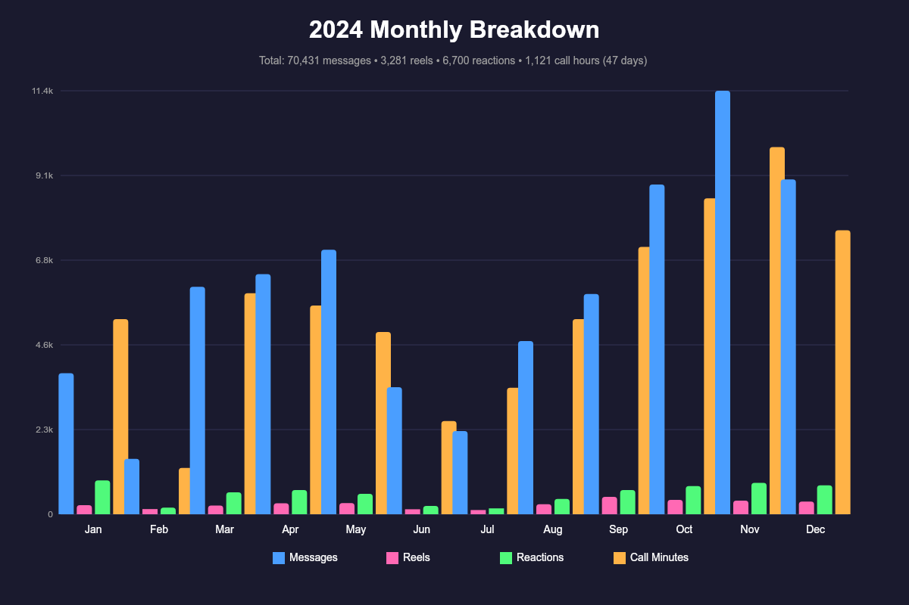
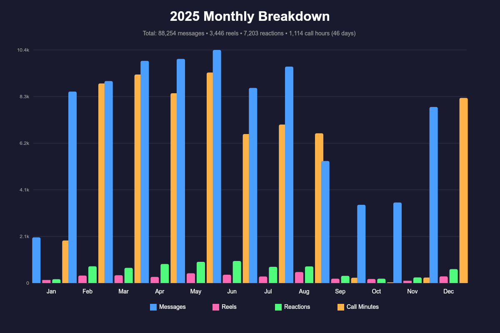
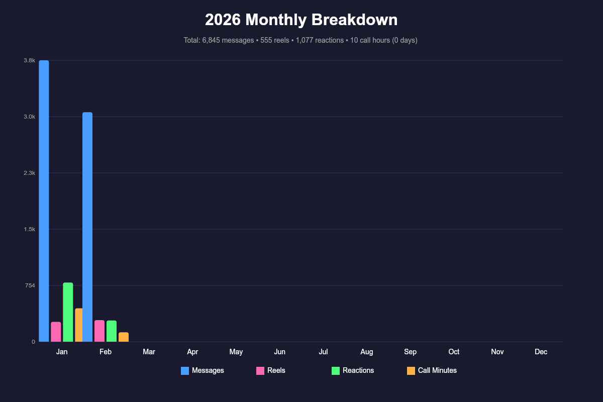
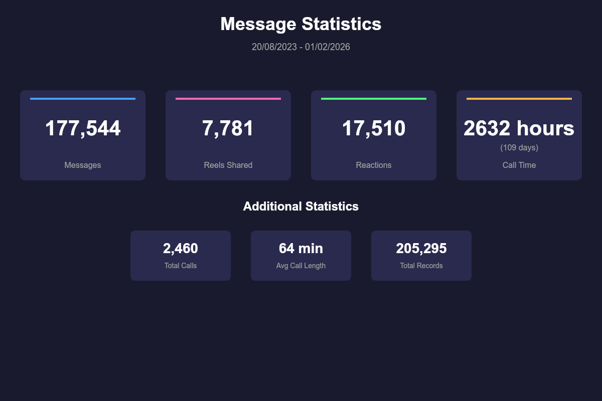

# Instagram Message Statistics

This tool generates statistics and visualisations from Instagram message data.

## Before running

This tool relies on data exported from instagram. To do this, go to the meta accounts centre, and request a download of your information. Ensure you include message in your download, no other data is required. Select HTML as the format for the download as this is what the tool expects.

Once downloaded, create a messageFiles folder and extract all the html files into it. 

## Usage

To run the tool, use the following command:

```bash
npm run runStats
```

This will generate a series of charts and save them to the output folder.

## Examples









